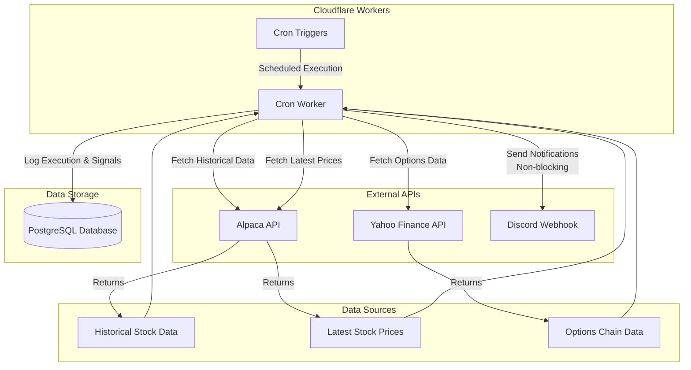
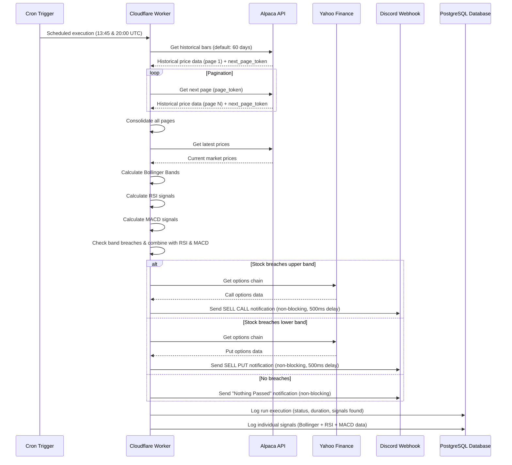
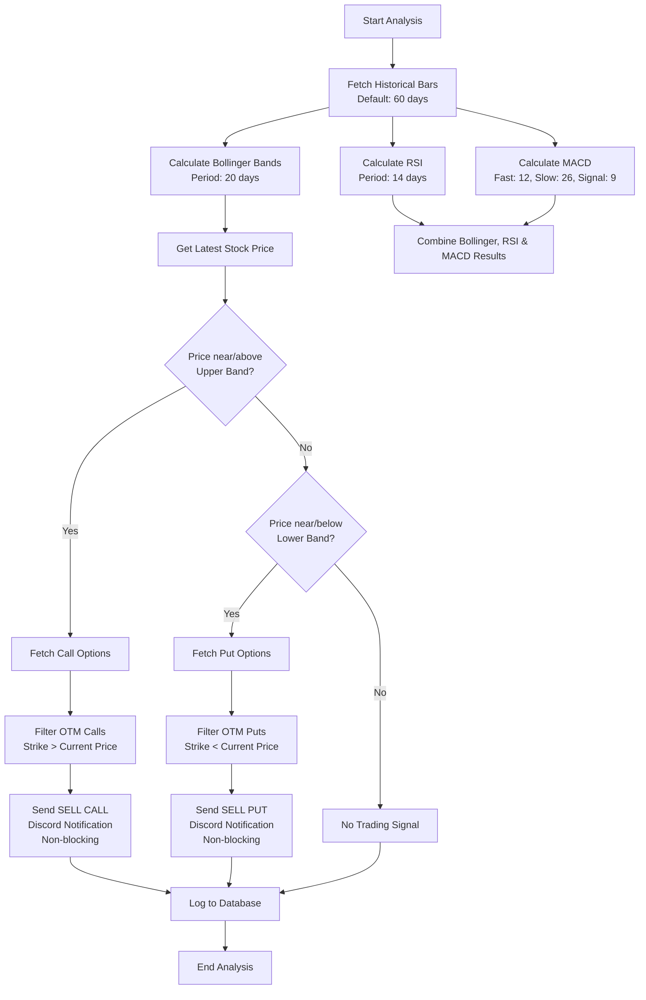

# Bollinger Checker Architecture Documentation

## Overview

The **bollinger-checker** is a Cloudflare Worker that monitors stock prices using Bollinger Bands, RSI (Relative Strength Index), and MACD (Moving Average Convergence Divergence) technical analysis. It runs on a scheduled basis to identify trading opportunities, sends notifications via Discord webhooks when stocks breach their Bollinger Band thresholds, and logs all execution runs and signals to a PostgreSQL database.

## System Architecture

## Data Flow

## Technical Analysis Flow

## Key Features

### 🕐 Scheduled Execution

- Runs twice daily during market hours (13:45 UTC & 20:00 UTC on weekdays)
- Powered by Cloudflare Workers Cron Triggers

### 📈 Technical Analysis

- **Bollinger Bands**: 20-period moving average with 2 standard deviations (default)
- **RSI (Relative Strength Index)**: 14-period RSI calculation with overbought (>70) and oversold (<30) thresholds
- **MACD (Moving Average Convergence Divergence)**: Calculates MACD line, signal line, and histogram
  - Fast EMA: 12 periods (default)
  - Slow EMA: 26 periods (default)
  - Signal EMA: 9 periods (default)
  - Crossover Detection: Identifies BULLISH (MACD crosses above signal), BEARISH (MACD crosses below signal), or NEUTRAL states
  - Requires minimum 35 bars of historical data (slowPeriod + signalPeriod)
- **Threshold Detection**: 1% proximity to band edges for Bollinger signals (default)
- **Signal Generation**: 
  - Upper band breach = Sell Calls
  - Lower band breach = Sell Puts
  - RSI signals: BUY (oversold), SELL (overbought), NEUTRAL
  - MACD signals: BULLISH (upward momentum), BEARISH (downward momentum), NEUTRAL
- **Combined Analysis**: Results combine Bollinger Band signals, RSI values, and MACD indicators for comprehensive trading insights

### 📊 Data Integration

- **Alpaca API**: Historical price data (60 days) and real-time quotes
- **Yahoo Finance**: Options chain data for trading opportunities
- **Multi-source reliability**: Combines different data providers

### 🔔 Smart Notifications

- **Discord Integration**: Rich embed notifications with options tables, RSI data, and MACD indicators
- **Non-blocking Execution**: Discord notifications use `ctx.waitUntil()` to run asynchronously without blocking main execution flow
- **Rate Limiting**: 500ms delay between webhook calls to prevent Discord API limits
- **Error Handling**: Robust error handling with success/failure tracking for each notification
- **Conditional Messaging**: Different messages for signals vs. no activity
- **Options Data**: Top 10 out-of-the-money options with strike, price, bid, ask, and IV (default limit)
- **RSI Display**: RSI values and signals (OVERBOUGHT/OVERSOLD/NEUTRAL) included in notifications
- **MACD Display**: MACD values, signal line, histogram, and crossover direction (BULLISH/BEARISH/NEUTRAL) included in notifications

### 💾 Database Persistence

- **Execution Logging**: All run executions are logged to PostgreSQL with:
  - Start/completion timestamps
  - Execution status (success/failed)
  - Duration metrics
  - Ticker count and signal counts (Bollinger, RSI, MACD)
  - Cron trigger information
  - Environment identifier

- **Signal Logging**: Individual trading signals are persisted with:
  - Bollinger Band data (signal type, current price, upper/lower bands)
  - RSI data (RSI value, signal type: BUY/SELL/NEUTRAL)
  - MACD data (MACD value, signal line value, histogram, crossover direction: BULLISH/BEARISH/NEUTRAL)
  - Ticker symbol and detection timestamp
  - Link to parent execution run

- **Database Schema**: Uses Drizzle ORM with PostgreSQL
  - `run_executions` table: High-level execution metadata
  - `run_signals` table: Individual signal details with foreign key to execution

## Logging and Observability

### Logger Abstraction

- The checker uses a simple logger abstraction (`ILogger`) to log progress and results.
- Default implementation (`consoleLogger`) prefixes messages with `[BollingerChecker][date(ISO8601)]` and writes to `console.log`.
- Logs during evaluation:
  - Per-symbol: `Finished checking {SYMBOL}`
  - Summary: `Total results: {N}`

### Pluggable Logging

- `evaluateBollingerSignals(bars, latestPrices, optionsProvider, logger?)` accepts an optional `logger` argument.
- Any object implementing `ILogger` (`{ log: (message: string) => void }`) can be injected (e.g., structured logger, no-op logger).
- If omitted, `consoleLogger` is used by default.

## Defaults and Tunables

- **Bollinger Period**: 20 (passed to the bands calculator; exposed via `getBollingerBands(bars, period = 20)`).
- **Bollinger Threshold**: 1% proximity to upper/lower bands for signal detection (within `isNearOrPastUpperBand`/`isNearOrPastLowerBand`).
- **RSI Period**: 14 days (default in `evaluateRsiSignals`)
- **RSI Overbought Threshold**: 70 (default)
- **RSI Oversold Threshold**: 30 (default)
- **MACD Fast Period**: 12 (default in `evaluateMacdSignals`)
- **MACD Slow Period**: 26 (default in `evaluateMacdSignals`)
- **MACD Signal Period**: 9 (default in `evaluateMacdSignals`)
- **MACD Minimum Bars**: 35 (slowPeriod + signalPeriod) required for calculation
- **Options Limit**: 10 top out-of-the-money options (calls above price, puts below price).

These defaults are encoded in code for simplicity and can be adjusted in future via configuration if needed.

### 🎯 Monitored Stocks

Currently tracking **31 major stocks** including:

- Tech giants: META, GOOGL, NVDA, MSFT, AAPL, AVGO
- Growth stocks: SNOW, NET, CRWD, SHOP, COIN
- Market leaders: TSLA, NFLX, ADBE, CRM, INTU
- Consumer brands: DIS, NKE, LULU, PYPL
- International: JD, MELI, CPNG
- Semiconductors: AMD, LRCX
- Other notable: ABNB, ADSK, TTD, ZM, XYZ

## Technology Stack

- **Runtime**: Cloudflare Workers (V8 JavaScript)
- **Language**: TypeScript
- **Build Tool**: Wrangler
- **Package Manager**: pnpm
- **Database**: PostgreSQL with Drizzle ORM
- **External APIs**: Alpaca Markets, Yahoo Finance
- **Notifications**: Discord Webhooks
- **Technical Indicators**: trading-signals library (RSI, Bollinger Bands, MACD)
