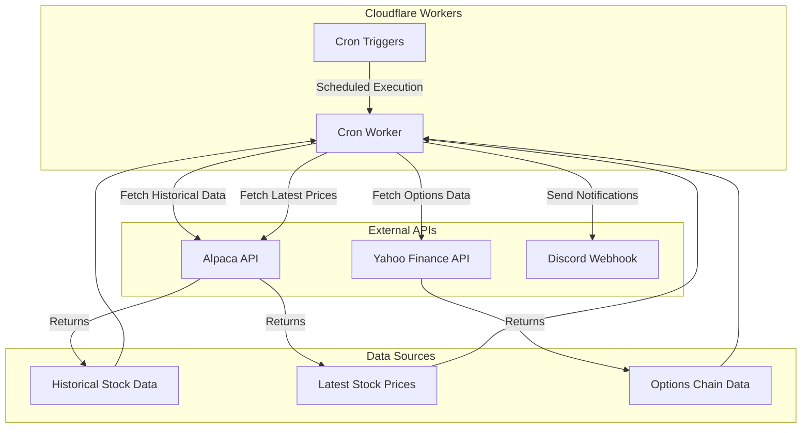
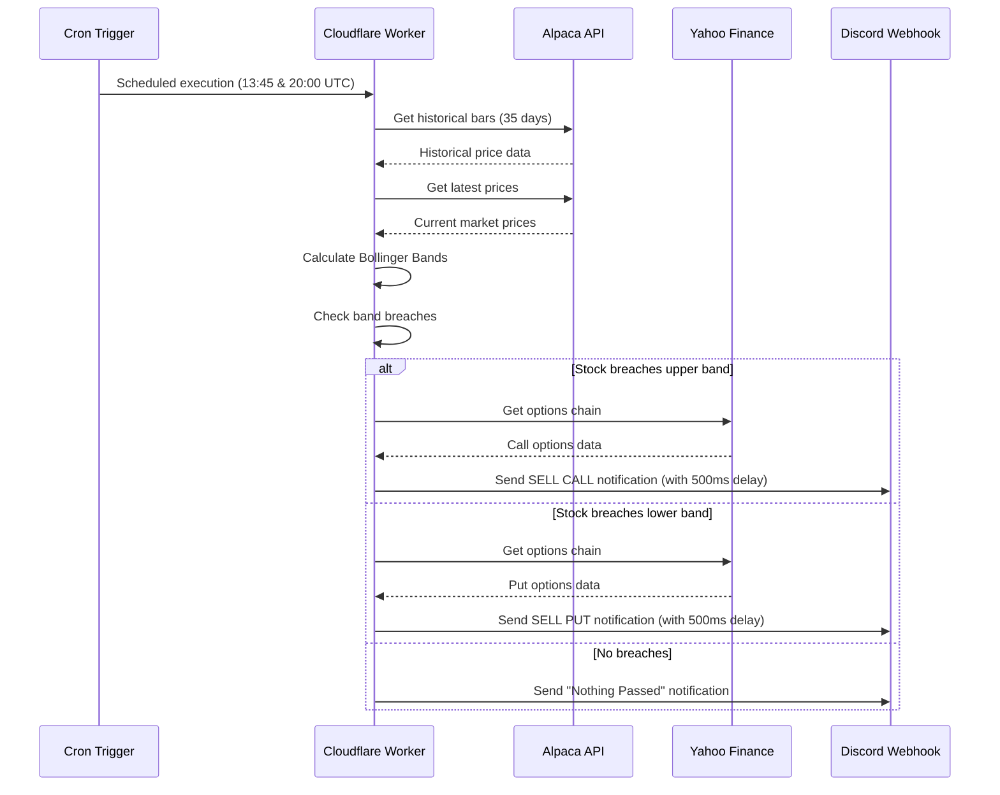
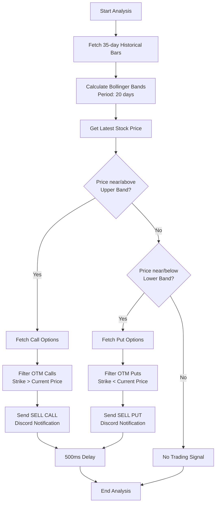

# Bollinger Checker Architecture Documentation

## Overview

The **bollinger-checker** is a Cloudflare Worker that monitors stock prices using Bollinger Bands technical analysis. It runs on a scheduled basis to identify trading opportunities and sends notifications via Discord webhooks when stocks breach their Bollinger Band thresholds.

## System Architecture

## Data Flow

## Technical Analysis Flow

## Key Features

### 🕐 Scheduled Execution

- Runs twice daily during market hours (13:45 UTC & 20:00 UTC on weekdays)
- Powered by Cloudflare Workers Cron Triggers

### 📈 Technical Analysis

- **Bollinger Bands**: 20-period moving average with 2 standard deviations (default)
- **Threshold Detection**: 1% proximity to band edges (default)
- **Signal Generation**: Upper band breach = Sell Calls, Lower band breach = Sell Puts

### 📊 Data Integration

- **Alpaca API**: Historical price data (35 days) and real-time quotes
- **Yahoo Finance**: Options chain data for trading opportunities
- **Multi-source reliability**: Combines different data providers

### 🔔 Smart Notifications

- **Discord Integration**: Rich embed notifications with options tables
- **Rate Limiting**: 500ms delay between webhook calls to prevent Discord API limits
- **Error Handling**: Robust error handling with success/failure tracking for each notification
- **Conditional Messaging**: Different messages for signals vs. no activity
- **Options Data**: Top 10 out-of-the-money options with strike, price, bid, ask, and IV (default limit)

## Logging and Observability

### Logger Abstraction

- The checker uses a simple logger abstraction (`ILogger`) to log progress and results.
- Default implementation (`consoleLogger`) prefixes messages with `[BollingerChecker][date(ISO8601)]` and writes to `console.log`.
- Logs during evaluation:
  - Per-symbol: `Finished checking {SYMBOL}`
  - Summary: `Total results: {N}`

### Pluggable Logging

- `evaluateBollingerSignals(bars, latestPrices, optionsProvider, logger?)` accepts an optional `logger` argument.
- Any object implementing `ILogger` (`{ log: (message: string) => void }`) can be injected (e.g., structured logger, no-op logger).
- If omitted, `consoleLogger` is used by default.

## Defaults and Tunables

- **Bollinger Period**: 20 (passed to the bands calculator; exposed via `getBollingerBands(bars, period = 20)`).
- **Threshold**: 1% proximity to upper/lower bands for signal detection (within `isNearOrPastUpperBand`/`isNearOrPastLowerBand`).
- **Options Limit**: 10 top out-of-the-money options (calls above price, puts below price).

These defaults are encoded in code for simplicity and can be adjusted in future via configuration if needed.

### 🎯 Monitored Stocks

Currently tracking **31 major stocks** including:

- Tech giants: META, GOOGL, NVDA, MSFT, AAPL, AVGO
- Growth stocks: SNOW, NET, CRWD, SHOP, COIN
- Market leaders: TSLA, NFLX, ADBE, CRM, INTU
- Consumer brands: DIS, NKE, LULU, PYPL
- International: JD, MELI, CPNG
- Semiconductors: AMD, LRCX
- Other notable: ABNB, ADSK, TTD, ZM, XYZ

## Technology Stack

- **Runtime**: Cloudflare Workers (V8 JavaScript)
- **Language**: TypeScript
- **Build Tool**: Wrangler
- **Package Manager**: pnpm
- **External APIs**: Alpaca Markets, Yahoo Finance
- **Notifications**: Discord Webhooks
