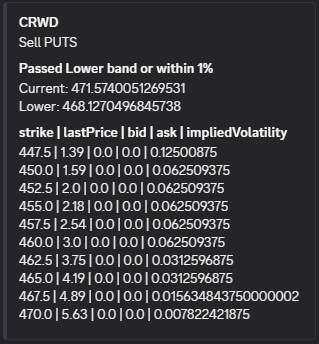
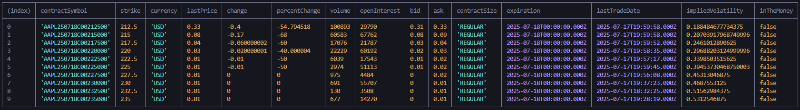

# BollingerBands on Workers

This project implements a Cloudflare Worker that uses cron triggers to run scheduled tasks for monitoring Bollinger Bands on financial tickers. Any tickers that pass their bands will trigger a discord notification.



It current uses Alpaca API for historical stock data and yahoo finance to obtain options chain data.

Alpaca data sample


Yahoo options data sample


It is setup to run on the following schedule:
 - `45 13 * * MON-FRI` // Runs at 13:45 UTC on weekdays
 - `0 20 * * MON-FRI` // Runs at 20:00 UTC on weekdays

## Local development

Add env variables using a `.dev.vars` file with the following variables

```
ALPACA_API_KEY
ALPACA_API_SECRET
DISCORD_WEBHOOK_URL
```

Starts up a local server for developing your Worker
```
pnpm dev
```

Use the `env` flag to switch between environments
```
pnpm dev -e=prod
```

Generate types based on your Worker configuration
```
pnpm cf-typegen
```

Run test scripts for the alpaca api
```
pnpm alpaca
```

## Deployment

Deploy your Wroker to Cloudflare
```
pnpm run deploy --env=""
```

Use the `env` flag to deploy to different environments
```
pnpm run deploy --env=prod
```

## Secret Management

Secret management is handled via Wrangler for secure configuration.

Adding secrets to cloudflare workers
```
npx wrangler secret put secret-name --env=""
```

## TODO

- [ ] Switch to cloudflare secrets store
- [x] Setup cloudflare github connection

## Contributing

Contributions are welcome! Please follow these guidelines:

1. **Fork the repository** and create your branch from `main`.
2. **Describe your changes** in clear commit messages.
3. **Test your code** before submitting a Pull Request.
4. **Submit a Pull Request** to the main repository and wait for review.

Please read any existing issues and add your feedback or suggest improvements. By contributing, you agree to abide by the project's code of conduct.
