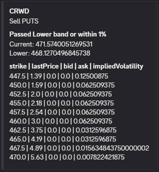
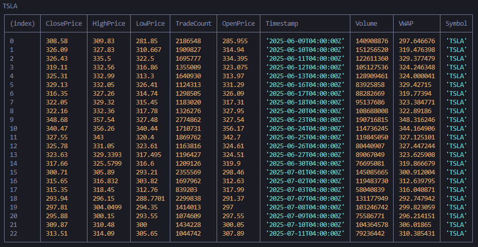
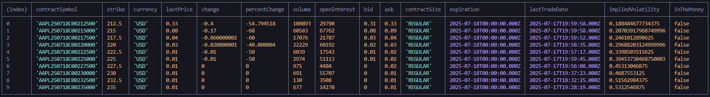

# BollingerBands on Workers

This project implements a Cloudflare Worker that uses cron triggers to run scheduled tasks for monitoring Bollinger Bands on financial tickers. Any tickers that pass their bands will trigger a discord notification.



It current uses Alpaca API for historical stock data and yahoo finance to obtain options chain data.

Alpaca data sample


Yahoo options data sample


It is setup to run on the following schedule:

- `45 13 * * MON-FRI` // Runs at 13:45 UTC on weekdays
- `0 20 * * MON-FRI` // Runs at 20:00 UTC on weekdays

## Local development

Add env variables using a `.dev.vars` file with the following variables

```
ALPACA_API_KEY
ALPACA_API_SECRET
DISCORD_WEBHOOK_URL
DATABASE_URL
ENVIRONMENT_NAME
```

Starts up a local server for developing your Worker

```
pnpm dev
```

Use the `env` flag to switch between environments

```
pnpm dev -e=prod
```

Generate types based on your Worker configuration

```
pnpm cf-typegen
```

Run test scripts for the alpaca api

```
pnpm alpaca
```

Run test scripts for yfinance setup

```
pnpm yahoo
```

## Adding environment variables

To add a new environment variable, update the [wrangler config](https://developers.cloudflare.com/workers/wrangler/configuration/#environment-variables)

Then run type gen

```
pnpm cf-typegen
```

## Deployment

**Note:** This project uses `pnpm` patches (see `patches/` directory). Due to a known issue, the Cloudflare GitHub integration does not properly apply patches during deployment. Therefore, it's recommended to deploy locally using the CLI commands below instead of relying on the automatic GitHub integration.

### Local CLI Deployment (Recommended)

Deploy manually to Cloudflare using the following commands

Deploy to the `dev` environment

```
pnpm run deploy
```

Deploy to `prod`

```
pnpm run deploy:prod
```

## Secret Management

Secret management is handled via Wrangler for secure configuration.

Adding secrets to cloudflare workers

```
npx wrangler secret put secret-name --env=""
```

Will prompt in the CLI what the secret value should be

## Database (Supabase)

Push table changes

```
npx drizzle-kit push
```

## TODO

- [x] Setup cloudflare github connection
