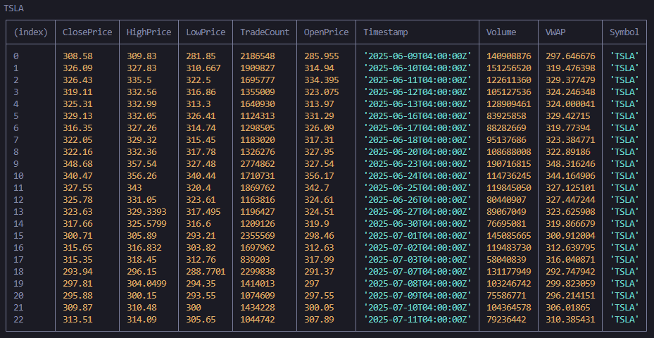

# BollingerBands on Workers

This project implements a Cloudflare Worker that uses cron triggers to run scheduled tasks for monitoring Bollinger Bands on financial tickers. Any tickers that pass their bands will trigger a discord notification.


It current uses Alpaca API for historical stock data and yahoo finance to obtain options chain data.

Alpaca data sample


Yahoo options data sample


It is setup to run on the following schedule:
 - `45 13 * * MON-FRI` // Runs at 13:45 UTC on weekdays
 - `0 20 * * MON-FRI` // Runs at 20:00 UTC on weekdays

## Local development

Add env variables using a `.dev.vars` file with the following variables

```
ALPACA_API_KEY
ALPACA_API_SECRET
DISCORD_WEBHOOK_URL
```

Starts up a local server for developing your Worker
```
pnpm dev
```

Use the `env` flag to switch between environments
```
pnpm dev -e=prod
```

Generate types based on your Worker configuration
```
pnpm cf-typegen
```

Run test scripts for the alpaca api
```
pnpm alpaca
```

Run test scripts for yfinance setup
```
pnpm yahoo
```

## Deployment

Deployment is handled via cloudflare integration with github, so any merges into `main` will kick off a deployment to both `dev` & `prod` workers

### Manual

We can also deploy manually to cloudflare with the following commands

Deploy to the `dev` environment
```
pnpm run deploy
```

Deploy to `prod`
```
pnpm run deploy:prod
```

## Secret Management

Secret management is handled via Wrangler for secure configuration.

Adding secrets to cloudflare workers
```
npx wrangler secret put secret-name --env=""
```

## TODO

- [x] Setup cloudflare github connection
